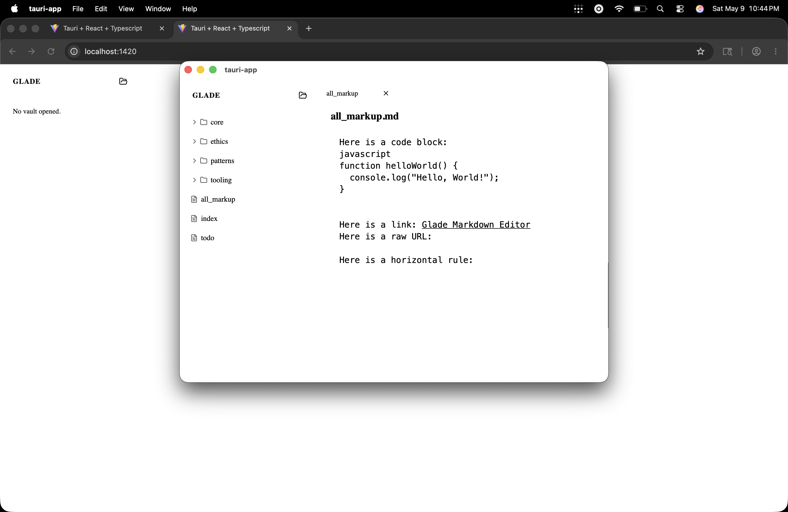

# Heading 1
## Heading 2
### Heading 3
#### Heading 4
##### Heading 5
###### Heading 6

This is a paragraph with **bold text**, *italic text*, and ***bold italic text***. We also support `inline code` snippets and ~~strikethrough~~ (if enabled).

You can also use alternate syntax like __bold__ and _italic_.

Here is a blockquote:
> This is a blockquote.
> It can span multiple lines.
> > And can be nested.
  
Here is an unordered list:
- Item 1
- Item 2
  - Nested Item 2.1
  - Nested Item 2.2
* Alternate item syntax
+ Another alternate item syntax

Here is an ordered list:
1. First item
2. Second item
   1. Nested first item
   2. Nested second item

Here is a checklist (interactive):
- [x] Incomplete task
- [x] Completed task
- [ ] Another pending task

Here is a code block:
```javascript
function helloWorld() {
  console.log("Hello, World!");
}
```

Here is a link: [Glade Markdown Editor](https://github.com)
  Here is a raw URL: https://example.com

Here is a horizontal rule:
___
***
---

Finally, an image:


Here is a table:
| Column 1 | Column 2 | Column 3 |
| -------- | -------- | -------- |
| Row 1 A  | Row 1 B  | Row 1 C  |
| Row 2 A  | Row 2 B  | Row 2 C  |
